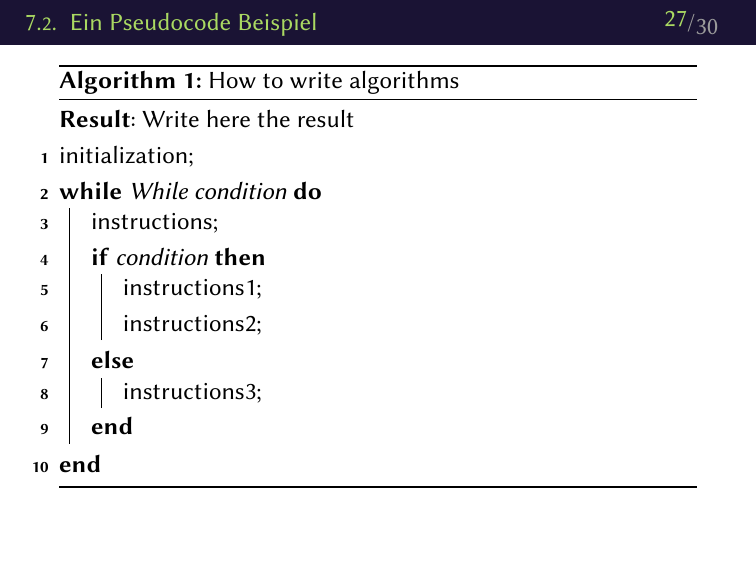
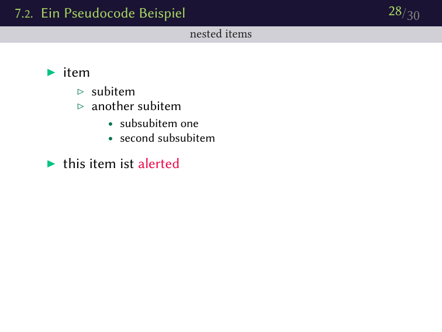
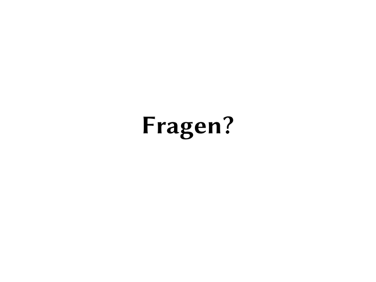
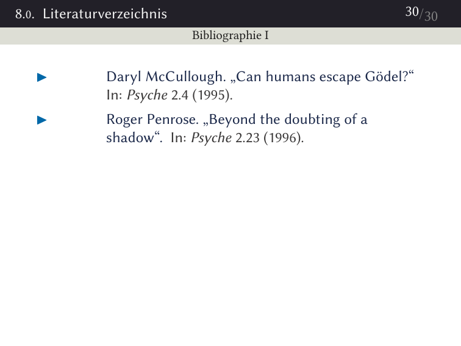

# XeLaTeX Beamer Template

Because all of the predefined beamer themes are overloaded with mostly useless stuff I decided to make my own minimalistic beamer theme.

## Requiremenets

Tools:

- xelatex
- biber
- makeglossaries

Fonts:

- Linux Biolinum
- Linux Libertine
- Consolas

Packages:

- see `content/misc/preamble.tex`
- I've installed the `texlive-most` meta-package on Arch, but `texlive-full` for ubuntu should also include all the needed packages

## Presentation Setup

The author, title, department etc. has to be set in `content/misc/variables.tex`.

## Build

Simply call `make`. This will call `make.sh` subsequently which `rsyncs` your content in the `build` directory and copies the generated pdf's to the `output` folder afterwards. The `rsync` step is done to prevent your `content` folder from being cluttered with countless of auxiliary files. If you don't have `cmake` and `rsync` try to install a reasonable operating system ;) .

---

## todo

- plain frame command
- convert theme to sty files [read](http://tex.stackexchange.com/questions/146529/design-a-custom-beamer-theme-from-scratch)

---

## Preview

